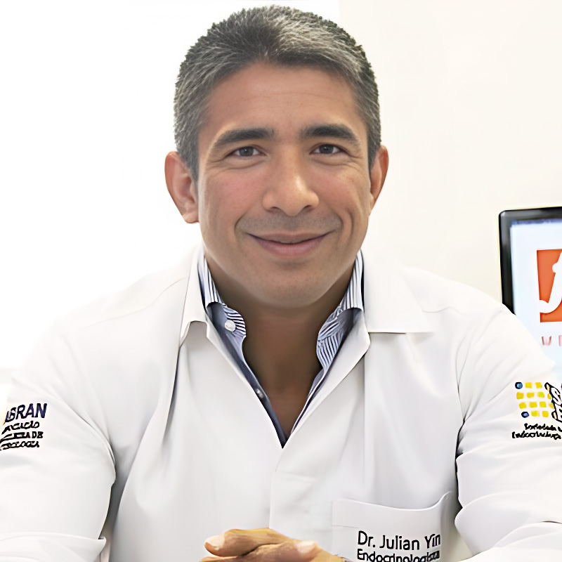

<html lang="en">
<head>
  <meta charset="UTF-8" />
  <title>Julian Y. V. Borges, MD, MS | Researcher CV (ORCID)</title>
  <meta name="viewport" content="width=device-width, initial-scale=1" />

  <!DOCTYPE html>
<html lang="en">
<head>
  <meta charset="UTF-8" />
  <title>Julian Y. V. Borges, MD, MS | Researcher CV (ORCID)</title>
  <meta name="viewport" content="width=device-width, initial-scale=1" />

  <!-- Optional Google Font -->
  <link href="https://fonts.googleapis.com/css2?family=Inter:wght@400;600;700;800&display=swap" rel="stylesheet">

  
</head>

<body>
  <main class="page">
    <!-- 👇 YOUR ENTIRE ORIGINAL BODY STARTS HERE AND IS PRESERVED UNCHANGED -->
    <!-- Copy from <header> to </main> from your original code -->

</head>

<body>
  <main class="page">

    <!-- TOP ROW: PHOTO + IDENTITY -->
    <header class="header">
      

        

          

          

            <h1>Julian Y. V. Borges, MD, MS</h1>
            
Clinician Scientist | Clinical Informatics | Responsible Clinical AI | Genomics

            
Clinical Research · Medical Informatics · AI Governance

            

              I connect clinical medicine, artificial intelligence, and genomic science to build data driven systems that advance precision endocrinology and enable safer,
              more effective clinical decision making. My work focuses on research, informatics, and digital health infrastructure that bridges clinical knowledge with academic
              investigation and real world deployment.
            

            

              <a class="badge" href="https://orcid.org/0009-0001-9929-3135" target="_blank" rel="noopener">ORCID</a>

              <a class="badge" href="https://www.linkedin.com/in/julian-borges-md/" target="_blank" rel="noopener" aria-label="LinkedIn">
                <svg class="badge-icon" viewBox="0 0 24 24" aria-hidden="true" focusable="false">
                  <path fill="currentColor" d="M20.447 20.452h-3.554v-5.569c0-1.328-.027-3.037-1.852-3.037-1.853 0-2.136 1.445-2.136 2.939v5.667H9.351V9h3.414v1.561h.046c.476-.9 1.637-1.85 3.368-1.85 3.6 0 4.266 2.368 4.266 5.455v6.286zM5.337 7.433A2.062 2.062 0 0 1 3.27 5.37c0-1.14.925-2.067 2.067-2.067 1.141 0 2.066.926 2.066 2.067 0 1.141-.925 2.063-2.066 2.063zM6.814 20.452H3.861V9h2.953v11.452zM22.225 0H1.771C.792 0 0 .774 0 1.729v20.542C0 23.227.792 24 1.771 24h20.451C23.2 24 24 23.227 24 22.271V1.729C24 .774 23.2 0 22.222 0h.003z"/>
                </svg>
              </a>

              <a class="badge" href="https://github.com/julian-borges-md" target="_blank" rel="noopener">GitHub</a>

              <a class="badge" href="https://x.com/julianborgesmd" target="_blank" rel="noopener" aria-label="X">
                <svg class="badge-icon" viewBox="0 0 24 24" aria-hidden="true" focusable="false">
                  <path fill="currentColor" d="M18.9 2H22l-6.8 7.8L23.2 22h-6.7l-5.2-6.5L5.7 22H2.6l7.4-8.5L1 2h6.8l4.7 6.1L18.9 2zm-1.2 18h1.7L7.1 3.9H5.3L17.7 20z"></path>
                </svg>
              </a>

              <a class="badge" href="https://dataverse.harvard.edu/dataverse/julian_borges" target="_blank" rel="noopener">Harvard Dataverse</a>
            

            <!-- KEYWORDS: full width visible frame, below contact block -->
          

        

      

    </header>

    <!-- FULL WIDTH CONTACT BOX -->
    

      

        

          
Countries

          
United States, Brazil

        

        

          
Primary email

          

            <a href="mailto:fxmedbrasil@gmail.com">fxmedbrasil@gmail.com</a>
          

        

        

          
Other IDs

          

            

              Scopus Author ID:
              <a href="http://www.scopus.com/inward/authorDetails.url?authorID=59247184100&partnerID=MN8TOARS" target="_blank" rel="noopener">59247184100</a>
            

            

              SciProfiles:
              <a href="https://sciprofiles.com/profile/3701785" target="_blank" rel="noopener">3701785</a>
            

            

              ResearcherID:
              <a href="https://www.webofscience.com/wos/author/record/KVZ-2689-2024" target="_blank" rel="noopener">KVZ-2689-2024</a>
            

          

        

        

          
Core methods and tooling

          
Python, R, Stata, SQL

        

      

    

    <!-- FULL WIDTH KEYWORDS BOX (VISIBLE FRAME, HORIZONTAL) -->
    

      <ul class="pill-list">
        <li>Artificial Intelligence</li>
        <li>Machine Learning</li>
        <li>Deep Learning</li>
        <li>AI Governance</li>
        <li>Digital Transformations</li>
        <li>Digital Health</li>
        <li>Cardio Endocrinology</li>
        <li>Molecular Endocrinology</li>
        <li>Circulatory Physiology</li>
        <li>Endothelial Dysfunction</li>
        <li>Vasculature Pathophysiology</li>
      </ul>
    

    <section>
      <h2>Research and Leadership Summary</h2>
      

        

          I am a clinician scientist and endocrinologist with more than 23 years of experience at the intersection of medicine, data science, and translational research.
          As Founder and CEO of FXMEDUS LLC, I lead initiatives integrating health informatics, computational biology, and artificial intelligence to design scalable solutions
          for metabolic and aging related diseases. Flagship platforms such as MitoCoreX and DrugSynthAI apply multi agent architectures, reinforcement learning, and in silico
          experimentation for compound generation, biomarker discovery, and mitochondrial therapeutics research.
        

        

          

            
Clinical AI governance and reproducibility

            
Auditability, evaluation discipline, data governance, and interoperability oriented infrastructure for safer translation to care.

          

          

            
Genomics and precision endocrinology

            
Translational inference with large scale omics, causal confounding awareness, and clinically actionable evidence framing.

          

        

      

    </section>

    <section>
      <h2>Employment</h2>
      

        

          

            
FxMEDUS LLC | Founder, CEO, Chief Scientist

            
North Miami, Florida, United States | 2024 to present

          

          
Digital transformation, digital health, clinical informatics research.

        

        

          

            
Afya Medical Post Graduation Institute | Associate Professor of Medicine

            
Goiânia, Goiás, Brazil | 2022 to present

          

          
Endocrinology, diabetes, and metabolism.

        

        

          

            
FxMED, Medicina Funcional | Staff Physician and Medical Director

            
Goiânia, Goiás, Brazil | 2011 to present

          

          
Endocrinology and clinical nutrition.

        

      

    </section>

    <section>
      <h2>Education and Qualifications</h2>
      

        

          
Graduate and Certificate Training

          <ul>
            <li>Boston University | MS Health Informatics (Data Analytics) candidate | 2025 to 2027</li>
            <li>Harvard Medical School | Global Clinical Scholars Research Training, Genetic Epidemiology elective (GCSRT)| 2024 to 2025</li>
            <li>UC San Diego | Drug discovery, development, and product management specialization | 2025</li>
            <li>Northeastern University | Health informatics for healthcare professionals certificate | 2025</li>
            <li>Johns Hopkins | Clinical informatics specialization | 2025</li>
            <li>Johns Hopkins | Bioinformatics, Python for genomic data science certificate | 2025</li>
            <li>NIH OCRECO | Principles and Practices of Clinical Pharmacology (IPCP)| 2025</li>
            <li>NIH OCRECO | Principles and Practices of Clinical Research (IPCR)| 2024</li>
            <li>HarvardX via edX | AI and machine learning with R and Python, statistics and R, Python for research | 2024</li>
            <li>Pontifícia Universidade Católica de Goiás | Medical genetics masters program | 2015 to 2016</li>
          </ul>
        

        

          
Medical Training and Board Certification

          <ul>
            <li>Centro Universitário Serra dos Órgãos | Doctor of Medicine MD | 1996 to 2002</li>
            <li>Endocrinology, diabetes and metabolism | Board certification (SBEM/CFM/AMB) | 2014</li>
            <li>Clinical nutrition and nutrology | Board certification (ABRAN/CFM/AMB)| 2013 to 2014</li>
            <li>Nutrology fellowship | 2012 to 2013</li>
            <li>Endocrinology fellowship | 2011 to 2013</li>
            <li>Medical biochemistry postgraduate program | 2006 to 2008</li>
            <li>Exercise and sports medicine postgraduate program | 2003</li>
          </ul>

          
Invited positions and distinctions

          <ul>
            <li>Academic Editor | PLOS Digital Health | 2025 to present</li>
            <li>Editor in Chief | International Journal of Epidemiology and Public Health Research | 2024 to present</li>
            <li>Board certification in endocrinology and diabetes | distinction | 2014</li>
            <li>Board certification in clinical nutrition | distinction | 2013</li>
          </ul>
        

      

    </section>

    <section>
      <h2>Membership and Service</h2>
      

        <ul>
          <li>American Physician Scientists Association | full member | 2024 to present</li>
          <li>American Medical Informatics Association | member, clinical informatics | 2024 to present</li>
          <li>American Medical Association | member | 2023 to present</li>
          <li>Endocrine Society | full member | 2022 to present</li>
          <li>American Society for Nutrition | full member | 2014 to present</li>
          <li>ACSM | full member | 2010 to present</li>
        </ul>
      

    </section>

    <section>
      <h2>Selected Publications and Research Artifacts</h2>
      

        

          This section is formatted for quick scanning by recruiters, collaborators, and review committees. Each link opens in a new tab.
        

        <ul>
          <li>
            Auditing Shortcut Learning and Misclassification in AI Based Breast Cancer Genomic Subtyping (2026).
            <a href="https://doi.org/10.1093/jamiaopen/ooaf177" target="_blank" rel="noopener">DOI:10.1093/jamiaopen/ooaf177</a>
             | Harvard Dataverse: 
            <a href="https://doi.org/10.7910/dvn/baljnt" target="_blank" rel="noopener">DOI:10.7910/dvn/baljnt</a>
          </li>

          <li>
            Multi Arm Bandit Governance for Clinical AI (software, Zenodo, 2026).
            <a href="https://doi.org/10.5281/zenodo.18248285" target="_blank" rel="noopener">DOI:10.5281/zenodo.18248285</a>
          </li>

          <li>
            Functional Foods and Nutraceuticals: Definitions and Health Benefits (book, 2025).
            <a href="https://doi.org/10.54448/MSP.978-65-983826-2-9" target="_blank" rel="noopener">DOI:10.54448/MSP.978-65-983826-2-9</a>
          </li>

          <li>
            Advancing Deep Learning Insights for Identifying Heart Disease in Diabetic Patients: A Data Mining Approach Using Logistic Regression and Random Forests (SSRN, 2025).
            <a href="https://doi.org/10.2139/ssrn.5091734" target="_blank" rel="noopener">DOI:10.2139/ssrn.5091734</a>
          </li>

          <li>
            Impact of Renal Function and Symptom Burden on Digoxin Efficacy and Safety: A Post Hoc Subgroup Analysis of the DIG Trial (Harvard Dataverse, dataset, 2025).
            <a href="https://doi.org/10.7910/dvn/zhyhy5" target="_blank" rel="noopener">DOI:10.7910/dvn/zhyhy5</a>
          </li>

          <li>
            Neuroplasticity Alterations Induced by Isotretinoin Use in RARA Gene Polymorphism is Associated with Increased Risk of Depression and Suicidal Ideation (systematic review and meta analysis, 2024).
            <a href="https://doi.org/10.47363/JPSRR/2024(6)173" target="_blank" rel="noopener">DOI:10.47363/JPSRR/2024(6)173</a>
          </li>

          <li>
            Oral Testosterone Therapy in Hypogonadal Men: A Comprehensive Systematic Review and Meta Analysis (2024).
            <a href="https://doi.org/10.1101/2024.09.22.24314162" target="_blank" rel="noopener">DOI:10.1101/2024.09.22.24314162</a>
             | 
            <a href="https://doi.org/10.54178/jsedmv6i3001" target="_blank" rel="noopener">DOI:10.54178/jsedmv6i3001</a>
          </li>

          <li>
            Translational Cardiology: Coenzyme Q10 Role as a Potential Therapeutic Agent for Cardiovascular Disease (2024).
            <a href="https://doi.org/10.33140/tmoa.02.01.04" target="_blank" rel="noopener">DOI:10.33140/tmoa.02.01.04</a>
          </li>

          <li>
            The Inverse Association between Testosterone Replacement Therapy and Cardiovascular Disease Risk (2024).
            <a href="https://doi.org/10.1101/2024.06.21.24309326" target="_blank" rel="noopener">DOI:10.1101/2024.06.21.24309326</a>
             | 
            <a href="https://doi.org/10.31579/2834-796x/073" target="_blank" rel="noopener">DOI:10.31579/2834-796x/073</a>
          </li>

          <li>
            Challenging the Salt Paradigm: Dietary Sodium Impact on Cardiovascular Risk (2024).
            <a href="https://doi.org/10.34297/AJBSR.2024.23.003132" target="_blank" rel="noopener">DOI:10.34297/AJBSR.2024.23.003132</a>
          </li>

          <li>
            Erectile Dysfunction as a Novel Biomarker for Cardiometabolic Vascular Disease Risk in the Aging Male (2024).
            <a href="https://doi.org/10.1101/2024.07.06.24310031" target="_blank" rel="noopener">DOI:10.1101/2024.07.06.24310031</a>
             | 
            <a href="https://doi.org/10.33140/ajun.06.01.06" target="_blank" rel="noopener">DOI:10.33140/ajun.06.01.06</a>
          </li>

          <li>
            A Machine Learning Framework for Early Detection of Cardiovascular Risk Using Diabetes Related Indicators (2024).
            <a href="https://doi.org/10.21203/rs.3.rs-4971115/v1" target="_blank" rel="noopener">DOI:10.21203/rs.3.rs-4971115/v1</a>
          </li>

          <li>
            Mitigating the Opioid Epidemic: The Role of Cannabinoids in Chronic Pain Management (2024).
            <a href="https://doi.org/10.1101/2024.07.14.24310378" target="_blank" rel="noopener">DOI:10.1101/2024.07.14.24310378</a>
             | 
            <a href="https://doi.org/10.33140/JAPM.09.03.05" target="_blank" rel="noopener">DOI:10.33140/JAPM.09.03.05</a>
          </li>

          <li>
            Trends in Sudden Cardiac Death in Pilots (2011 to 2023) (2024).
            <a href="https://doi.org/10.1101/2024.06.29.24309708" target="_blank" rel="noopener">DOI:10.1101/2024.06.29.24309708</a>
             | 
            <a href="https://doi.org/10.33140/IJPMC.02.02.04" target="_blank" rel="noopener">DOI:10.33140/IJPMC.02.02.04</a>
          </li>

          <li>
            Artificial Intelligence in Pain Management: Advancing Translational Science in Digital Health Research from Bench to Bedside (2024).
            <a href="https://doi.org/10.33140/AMLAI.05.03.04" target="_blank" rel="noopener">DOI:10.33140/AMLAI.05.03.04</a>
          </li>

          <li>
            Emerging Digital Health Interventions Toward Cardiovascular Care: Key Insights for 2025 (2024).
            <a href="https://doi.org/10.2139/ssrn.4981082" target="_blank" rel="noopener">DOI:10.2139/ssrn.4981082</a>
          </li>

          <li>
            Erectile Dysfunction and Cardiovascular Disease Risk: Updated 2024 systematic review meta analysis (2024).
            <a href="https://doi.org/10.21203/rs.3.rs-4681079/v1" target="_blank" rel="noopener">DOI:10.21203/rs.3.rs-4681079/v1</a>
          </li>

          <li>
            Innovative E Health Technologies for Cardiovascular Disease Treatment: 2024 updated systematic review and meta analysis (2024).
            <a href="https://doi.org/10.1101/2024.06.29.24309706" target="_blank" rel="noopener">DOI:10.1101/2024.06.29.24309706</a>
          </li>

          <li>
            Major clinical outcomes and discussions of religiosity spirituality in patients with palliative care and nutrology therapy (2024).
            <a href="https://doi.org/10.54448/IJN24409" target="_blank" rel="noopener">DOI:10.54448/IJN24409</a>
          </li>

          <li>
            Precision Medicine in Cardiology: Biomarkers in coronary artery disease prevention, thematic review (2024).
            <a href="https://doi.org/10.1101/2024.07.01.24309804" target="_blank" rel="noopener">DOI:10.1101/2024.07.01.24309804</a>
             | 
            <a href="https://doi.org/10.26502/FCCM.92920395" target="_blank" rel="noopener">DOI:10.26502/FCCM.92920395</a>
          </li>

          <li>
            The Inverse Association between Potassium Intake and Cardiovascular Disease Risk (2024).
            <a href="https://doi.org/10.21203/RS.3.RS-4699824/V1" target="_blank" rel="noopener">DOI:10.21203/RS.3.RS-4699824/V1</a>
          </li>

          <li>
            Thromboembolic Risk and Testosterone Replacement Therapy: Debunking myths and clarifying evidence (2024).
            <a href="https://doi.org/10.21203/RS.3.RS-5134020/V1" target="_blank" rel="noopener">DOI:10.21203/RS.3.RS-5134020/V1</a>
          </li>
        </ul>

        

          Peer review activity (summary): PLOS Digital Health (36), European Journal of Preventive Cardiology (7), European Heart Journal (2), Diabetes and Metabolic Syndrome (2), Nature Reviews (1), Journal of Advances in Medicine and Medical Research (1).
        

      

    </section>

    <section class="section two-column">
      

        <h2>Editorial Roles and Peer Review</h2>
        

          
Editorial Roles

          <ul>
            <li>Academic Editor, PLOS Digital Health</li>
            <li>Editorial Board Member, International Journal of Diabetes and Endocrinology</li>
            <li>Editorial Board Member, International Journal of Epidemiology and Public Health Research</li>
          </ul>

          
Peer Review

          

            Reviewer for journals including PLOS Digital Health, European Heart Journal Digital Health, NaTure Reviews and European Journal of Preventive Cardiology, focused on clinical research rigor, digital health translation, and clinical analytics integrity.
          

        

      

      

        <h2>Research Portfolio Themes</h2>
        

          <ul>
            <li>Clinical research infrastructure and governance models enabling safe translation to care</li>
            <li>Clinical AI governance, auditability, and deployment safety in real clinical environments</li>
            <li>Applied analytics for cardiometabolic risk stratification and outcomes measurement</li>
            <li>Genomic epidemiology and bioinformatics for translational inference and precision prevention</li>
          </ul>

          
MitoCoreX Project, Principal Investigator

          

            AI enabled discovery and development platform designed to optimize mitochondrial function through genomics aware targeting, multi agent systems, and in silico validation for aging related disease, neurodegeneration, and metabolic performance.
          

        

      

    </section>

    <section class="section">
      <h2>Professional Affiliations</h2>
      

        <ul>
          <li>American Medical Informatics Association (AMIA)</li>
          <li>American Medical Association (AMA)</li>
          <li>Endocrine Society</li>
          <li>American Society for Nutrition (ASN)</li>
          <li>American College of Sports Medicine (ACSM)</li>
          <li>American Physician Scientists Association (APSA)</li>
          <li>American College of Physicians (ACP)</li>
          <li>Brazilian Society of Endocrinology and Metabolism (SBEM)</li>
          <li>Brazilian Medical Nutrition Association (ABRAN)</li>
          <li>Brazilian Society of Sports Medicine (SBME)</li>
        </ul>
      

    </section>

    <section class="section">
      <h2>Clinical Imaging Training</h2>
      

        

          Completed structured programs in obstetric, transvaginal, internal medicine, and musculoskeletal ultrasound at FÉRTILE Diagnósticos,
          an accredited SBUS teaching center in Goiânia, Brazil, including more than three hundred hours of theoretical and hands on training across obstetric,
          gynecologic, abdominal, and musculoskeletal imaging.
        

      

    </section>

    <section class="section">
      <h2>Contact and Executive Collaboration</h2>
      

        
<strong>Email:</strong> <a href="mailto:jyborges@bu.edu">jyborges@bu.edu</a>

        
<strong>Phone:</strong> +1 617 895 8403

        

          Open to full time senior clinical research leadership roles focused on clinical trial expansion, translational infrastructure, investigator enablement, and research enterprise growth across Northern New England.
        

      

    </section>

  </main>
</body>
</html>
